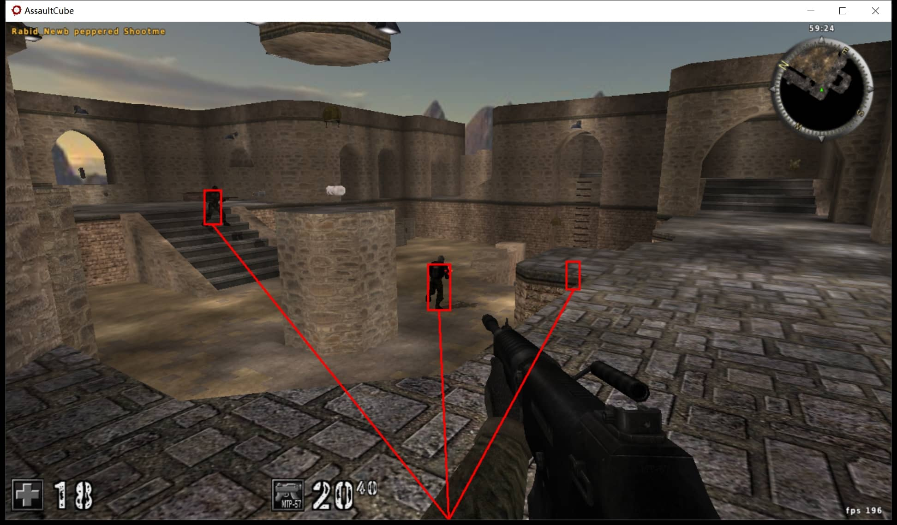

<p align="center">

</p>

# AssaultCube ESP DLL with Rust 🦀

Bilibili Video: [https://www.bilibili.com/video/BV1dN4y1e7Me](https://www.bilibili.com/video/BV1dN4y1e7Me)

Applicable Game Version: **1.3.0.2**

## How to use

1. Download `ac_esp.dll` from [releases](https://github.com/jerryshell/ac-esp/releases)
2. Run AssaultCube in **Windowed Mode**
3. Inject `ac_esp.dll` into AssaultCube ( You can do this with [Process Hacker](https://processhacker.sourceforge.io) )

## Build DLL

```sh
cargo build --release --target=i686-pc-windows-msvc
```

or

```sh
cross build --release --target=i686-pc-windows-gnu
```

## Screenshot



## Related

- [ac-aimbot](https://github.com/jerryshell/ac-aimbot)
- [windows-ez-overlay](https://github.com/jerryshell/windows-ez-overlay)

## References

- [About Windows](https://learn.microsoft.com/en-us/windows/win32/winmsg/about-windows)
- [Rust for Windows](https://kennykerr.ca/rust-getting-started)
- [Windows GDI](https://learn.microsoft.com/en-us/windows/win32/gdi/windows-gdi)

## LICENSE

[GNU Affero General Public License v3.0](https://choosealicense.com/licenses/agpl-3.0/)
